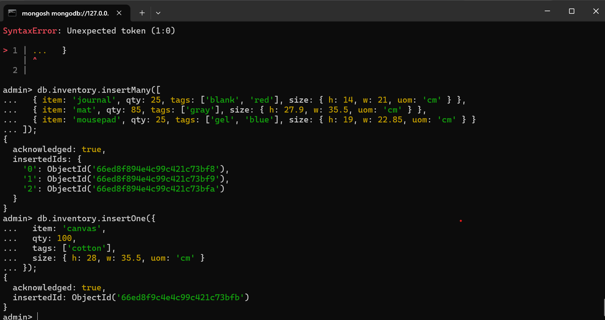
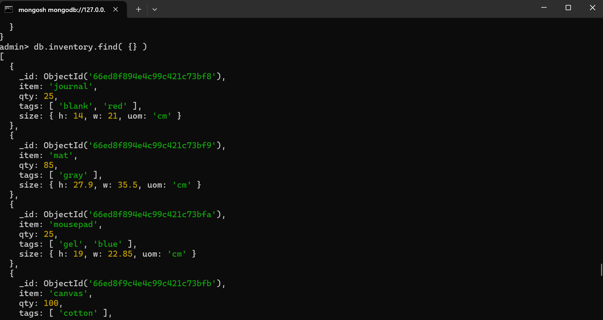
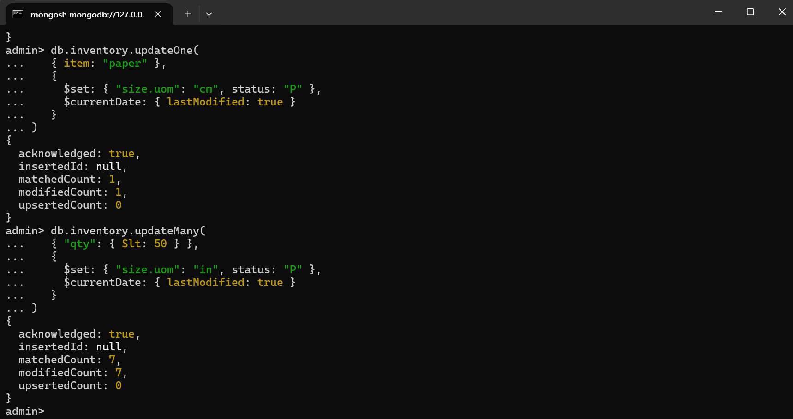
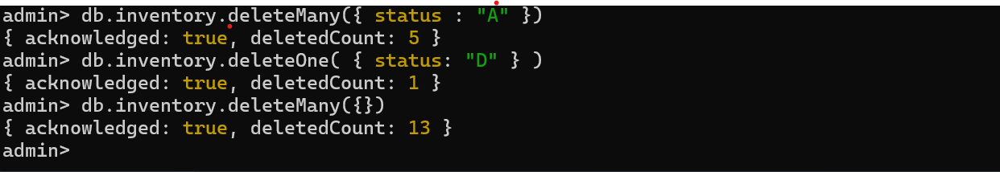
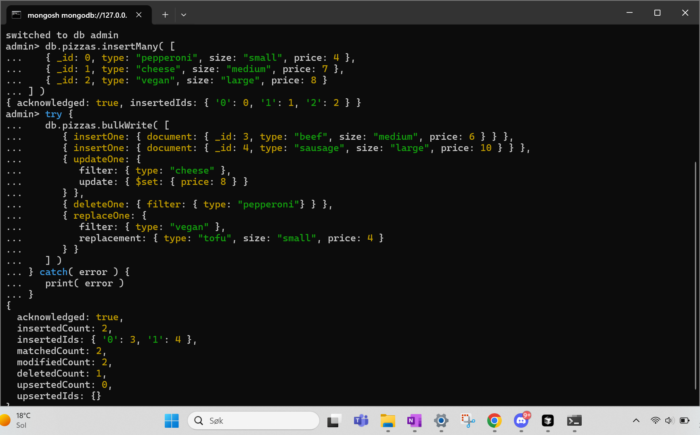
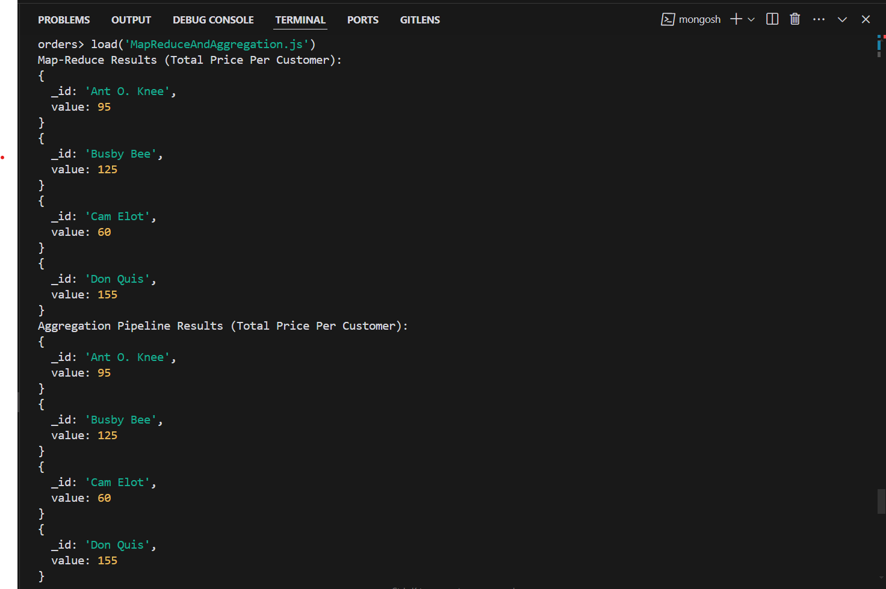
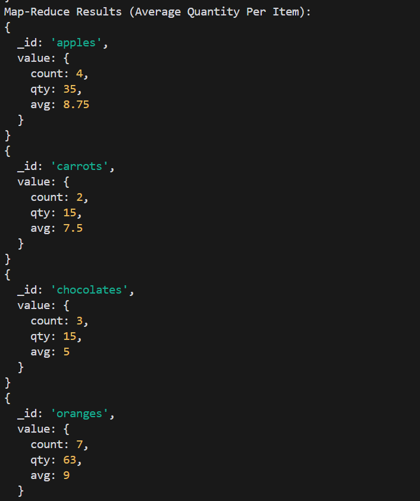
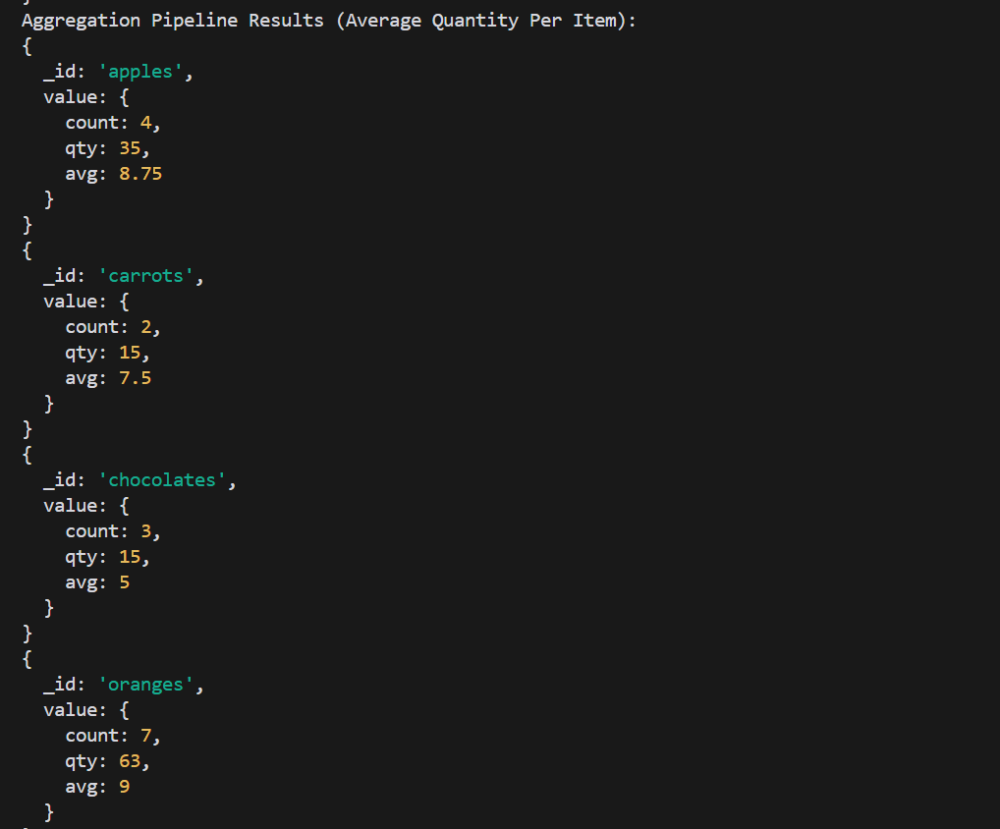

# MongoDB 

## Explanation
To solve these tasks I used MongoSH together with Mongo Compass. For some of the operations I made typescripts or javaScripts also. Either I just typed in the commands in the terminal, or I would run the scripts. I followed the installation guides to install everything, which all went fine.

## Challenges
* It was challenging to understand how to run the queries and the commands. After a while I understood that I could download and use mongosh in the terminal, and then select the code from the turorials which could be used in terminal. I started first using MongoDB compass, which was okay, but I did not manage to run all commands there. I found it easier to use mongosh.
* It was hard to understand what MONGODB actually was in the beginning. I now understand that it is a tool for handling databases, which is easy to scale. There are different ways to handle the data within this tool.
* It took some tries to be able to run the verification of the hash of the MongoDB installation file. I solved the task by creating a powershell script which I ran in powershell. I finally got correct output when I saw that I had a small typo in one of the filenames. I tried also different options like gitBash and wsl. 

#Verification of the MongoDB Compass

* The powershell that was run was checkMongoDBHash.ps1, which is located in the same folder as this one. The location of the file was in the download folder, so the script will not work from this repository. 

## Screenshots from Experiment 1, Crud Operations:

## Screenhots from Experiment 2, aggregation and map reduce: 

* In experiment 2 we show screenshots from the file MapReduceAndAggregation.js, which also is in the same folder as this one. This file was run in mongosh, and the file is containing two examples, which both are solved using map reduce and aggregation. We get the same result in both cases. The output is saved to the file output.txt. 
* The Map reduce function is useful because it allows us to group data by various fields and the perform calculations on the grouped data. In many cases we are interested in a subgroup of the data. 
* In the first example we calculate the total price for each customer. Total price for each customer is useful to know for a business, because it helps the business to know which customers are important and how to adjust their sales strategy based on more information.
* In the second example we calculate the average price for each product, based on orders on or after 2020-03-01. This is displayed together with the count and the qantity of each product. Count means how many orders the product is a part of, while the quantity are the total products of this type in all orders. This is useful for a business to know because it helps to them to understand which products are selling the most in a certain period of time. This can be used to adapt their sales strategy to be even better.     