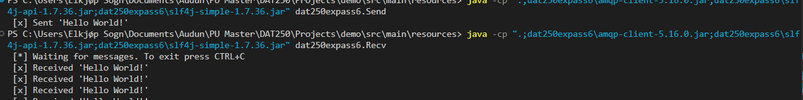

# Assignment 6

## Explanation 
During the tasks and the installation I got some help from ChatGPT when I was stuck. The tutorials were good, so I managed to find solutions to the problems that occured. Underneath are some screenshots from Experiment 2-4. 

## Experminet 2 - Hello world

In this task I made a producer and a consumer of messages. 

Terminal output:

## Experminet 3 - Work Queues

In this task we have multiple consumers, which reads messages in turn. 

Terminal 1 producer:

Terminal 2 consumer:

Terminal 3 consumer: Does the tasks that are not shown in terminal 2.

## Experiment 4 - Topics

In this task we are seeing how to organize messages in exchanges. In our case consumers see all messages within the exchange.

Terminal output:

We also list the bindings in the terminal, which makes us able to verify that the code actually creates code and queues as we want.

## Challenges
* In the beginning it was challenging to set up the producer and consumera correctly, so that they interracted correctly. I troubleshooted together with ChatGPT, and one of the errors was that java was not set up correctly. I reorganized the file structure to resolve compilation issues. 
* I also had running the rabbitmqtl list_bindings command. I solved this problem by making sure that two erlang cookie-files were matched. These have to do with authentication of commands in the terminal.

## Completion
* I managed to solve all the parts of the assignment.